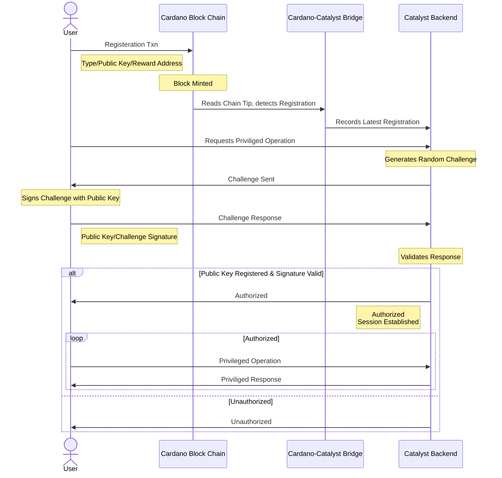

# Permissionless Auth

```mermaid
sequenceDiagram
    actor U as User
    participant B as Cardano Block Chain
    participant Br as Cardano-Catalyst Bridge
    participant C as Catalyst Backend

    U->>B: Registeration Txn
    Note right of U: Type/Public Key/Reward Address
    Note over B: Block Minted
    B->>Br: Reads Chain Tip, detects Registration
    Br->>C: Records Latest Registration

    U->>C: Requests Priviliged Operation
    Note over C: Generates Random Challenge
    C->>U: Challenge Sent
    Note over U: Signs Challenge with Public Key
    U->>C: Challenge Response
    Note right of U: Public Key/Challenge Signature
    Note over C: Validates Response
    alt Public Key Registered & Signature Valid
      C->>U: Authorized
      Note left of C: Authorized<br>Session Established
      loop Authorized
        U->>C: Privileged Operation
        C->>U: Priviliged Response
      end
    else Unauthorized
      C->>U: Unauthorized
    end
```
